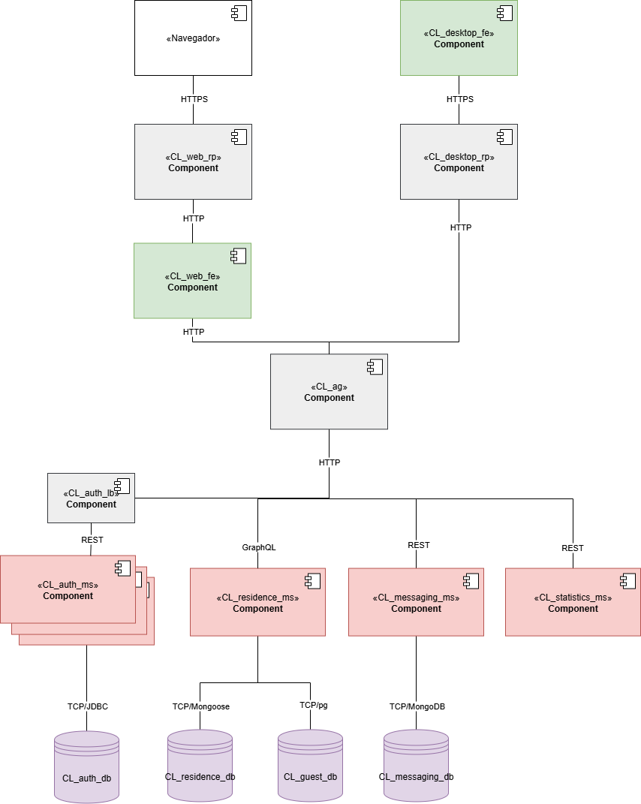
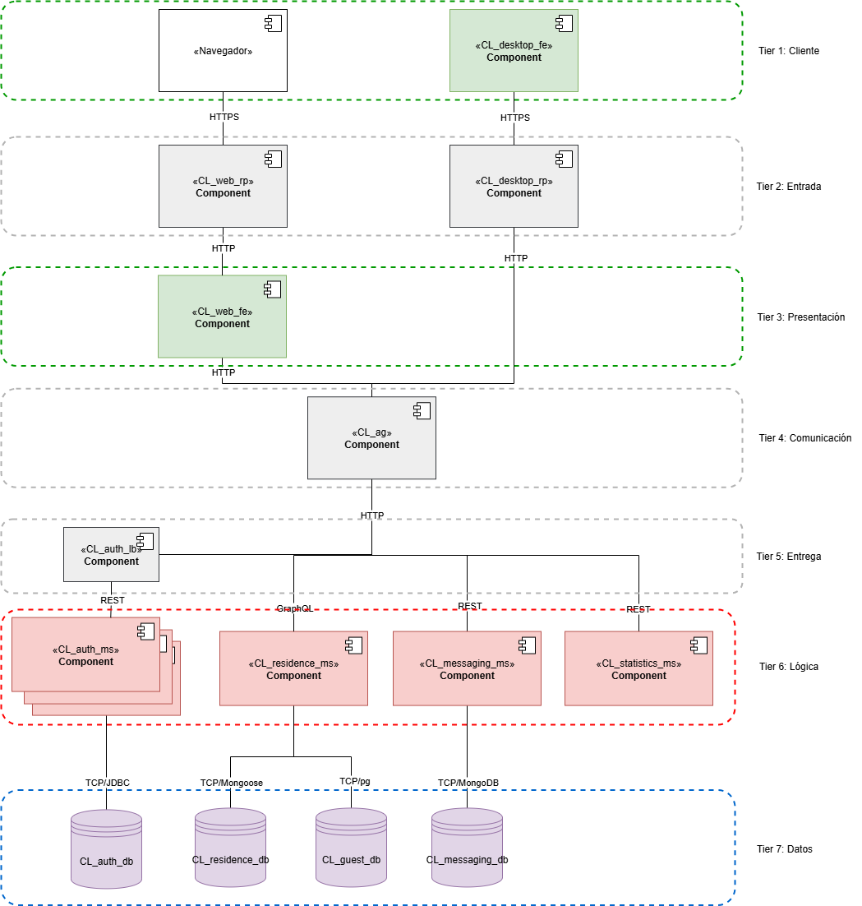
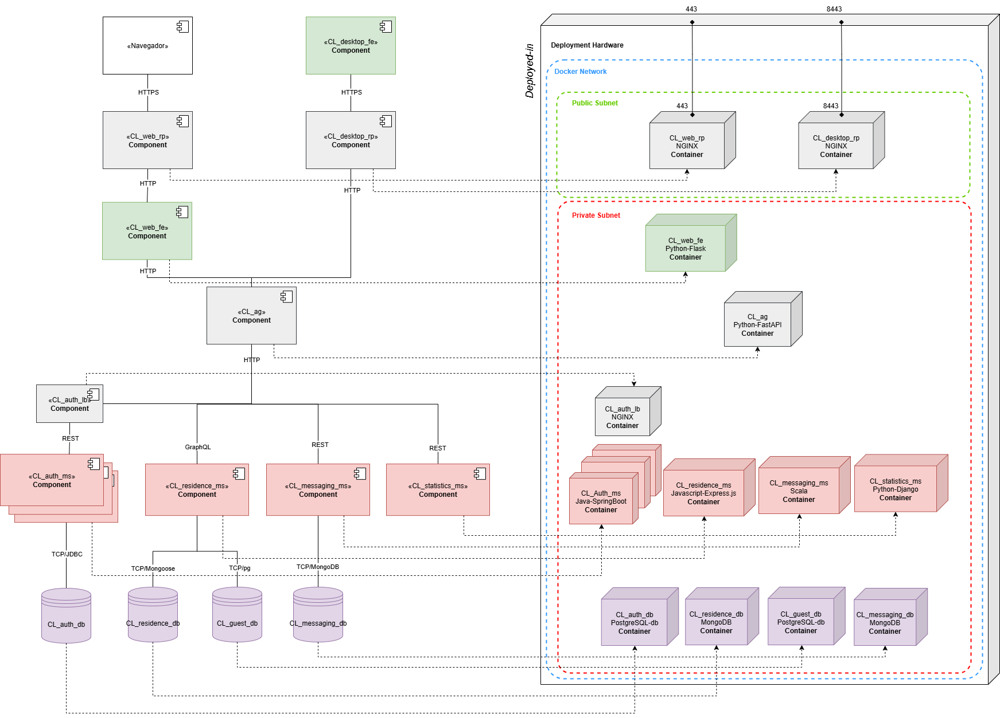
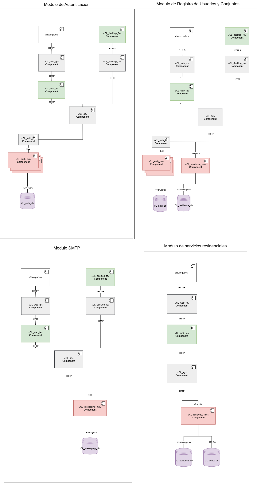
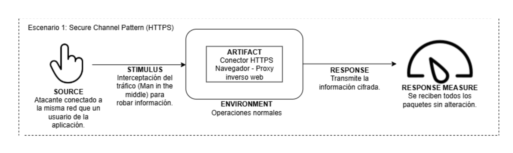
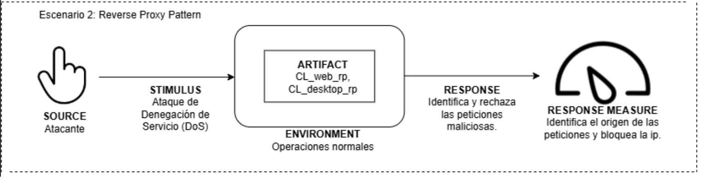
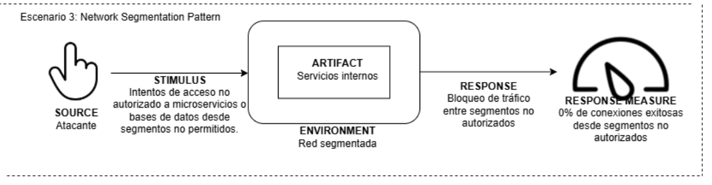
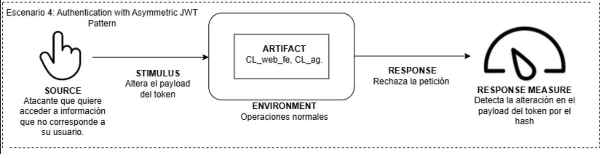
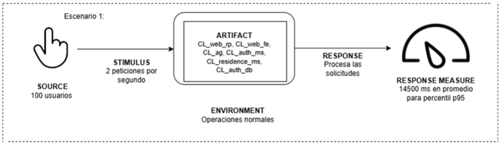

# **Prototipo 3 Arquitectura de Software 2025-1**

# **Team**
### Equipo 1B

- Daniel Felipe Villamor (Arquitecto líder)
- Byron Daniel Giraldo Castro
- Camilo Andres Roncancio Toca 
- Ivan Yesid Sepulveda Paez
- Javier Santiago Vargas Parra
- Jonathan Steven Ochoa Celis
- Julian David Huertas Dominguez

# **Software System**
### Name: **COLive**
### Logo:
 
### Description
COLive es una plataforma digital diseñada para optimizar la administración de conjuntos residenciales. El sistema permite a los propietarios registrar su conjunto en la plataforma y gestionar de manera centralizada todos los procesos asociados a la convivencia y operación del conjunto.

Entre sus funcionalidades destacan la creación y administración de cuentas para apartamentos e inquilinos, la reserva de espacios comunes, la gestión de parqueaderos y visitantes, el envío de mensajes internos, la generación de notificaciones y la administración del personal encargado del conjunto (como administradores, personal de aseo y vigilancia).

COLive busca mejorar la comunicación, eficiencia y transparencia en la gestión residencial, brindando a administradores y residentes una herramienta moderna y confiable para el manejo diario de su comunidad.
# **Architectural Structures**
### **Component-and Connector (C&C) Structure**
### C&C View
 
### **Description of architectural styles and patterns used**
### Estilos arquitectónicos: 
1. **Cliente servidor:** Este estilo representa la base de la mayoría de los sistemas distribuidos. En COLive, los clientes (navegadores, proxys, microservicios, etc) se comunican con los servidores (otros componentes) que exponen interfaces bien definidas para consumir la funcionalidad del sistema.
2. **Basada en servicios / Microservicios:** 
El sistema está estructurado como un conjunto de microservicios independientes, cada uno encargado de una funcionalidad específica o funcionalidades estrechamente relacionadas entre sí (por ejemplo, autenticación, gestión de residentes y reservas, envío de mensajes, etc.). Este enfoque permite el desarrollo, despliegue y escalamiento independiente de los servicios, y favorece la evolución modular del sistema.

### Patrones arquitectónicos: 
* **Patrón API Gateway:** Para gestionar de manera centralizada el acceso a los microservicios, se implementó el patrón API Gateway. Este componente actúa como único punto de entrada para el consumo de las funcionalidades del sistema, encapsulando la lógica de ruteo y orquestación entre los microservicios.

### **Description of architectural elements and relations**

### Elementos arquitectónicos
#### Componentes:
* **CL_desktop_fe (Frontend de escritorio):**
Aplicación de escritorio instalada en los dispositivos de los usuarios. Sirve como cliente para consumir los servicios del sistema a través de un proxy inverso.
* **CL_web_rp (Reverse Proxy Web):**
Proxy inverso que actúa como intermediario entre los navegadores web y el frontend web del sistema, facilitando la seguridad, el enrutamiento y el manejo de certificados SSL.
* **CL_desktop_rp (Reverse Proxy Escritorio):**
Proxy inverso utilizado por la aplicación de escritorio para comunicarse de forma segura con el sistema, facilitando el acceso centralizado y seguro al API Gateway.
* **CL_web_fe (Frontend Web):**
Aplicación web que presenta la interfaz gráfica del sistema a los usuarios desde navegadores. Presenta un lado servidor donde se hace Server Side Rendering y se expone una Closed-API para consumir los servicios del backend a través del API Gateway.
* **CL_ag (API Gateway):**
Punto de entrada unificado para todos los frontends. Se encarga de enrutar las solicitudes a los microservicios apropiados y orquestar funcionalidades que requieren múltiples microservicios.
* **CL_auth_lb (Load Balancer de Autenticación):**
Distribuye las solicitudes de autenticación entre múltiples instancias del microservicio de autenticación, favoreciendo la escalabilidad y disponibilidad del sistema.
* **CL_auth_ms (Microservicio de Autenticación) [3 instancias]**:
Gestiona la creación de usuarios, inicio de sesión, la verificación de credenciales y la emisión de tokens. Está replicado para tolerancia a fallos y mayor rendimiento. 
* **CL_residence_ms (Microservicio de Conjuntos Residenciales):**
Encargado de las funcionalidades relacionadas con los conjuntos residenciales, residentes y apartamentos: gestión de conjuntos, reservas y parqueaderos.
* **CL_messaging_ms (Microservicio de Mensajería):**
Maneja el envío de correos entre los distintos actores del sistema mediante una cola de mensajería interna.
* **CL_statistics_ms (Microservicio de Estadísticas):**
Proporciona estadísticas agregadas y métricas sobre la actividad del sistema, útiles para los administradores.
* **CL_auth_db (Base de Datos de Autenticación):**
Almacena la información de usuarios, contraseñas encriptadas, roles y relaciones con conjuntos residenciales y residencias.
* **CL_residence_db (Base de Datos de Conjuntos Residenciales):**
Base de datos NoSQL que almacena información sobre los conjuntos y las residencias.
* **CL_messaging_db (Base de Datos de Mensajería):**
Almacena la cola de correos dentro del sistema.
# REVISAR
* **CL_guest_db (Base de Datos de Invitados):**
Guarda la información de las visitas e invitados que los residentes autorizan para ingresar.

#### Conectores y relaciones
* **Navegador → HTTPS → CL_web_rp:**  Los navegadores web se comunican de forma segura mediante HTTPS con el proxy inverso web.
* **CL_desktop_fe → HTTPS → CL_desktop_rp:**
La aplicación de escritorio establece conexiones HTTPS seguras con su respectivo proxy inverso.
* **CL_web_rp → HTTP → CL_web_fe:**
El proxy inverso redirige las solicitudes al frontend web usando HTTP interno.
* **CL_desktop_rp → HTTP → CL_ag:**
El proxy inverso de escritorio enruta las solicitudes hacia el API Gateway mediante HTTP.
* **CL_web_fe → HTTP → CL_ag:**
El lado servidor del frontend web consume los servicios backend mediante peticiones HTTP al API Gateway.
* **CL_ag → HTTP → CL_auth_lb:**
El API Gateway enruta las solicitudes dirigidas al microservicio de autenticación a su respectivo balanceador de carga.
* **CL_auth_lb → HTTP (REST) → CL_auth_ms (3):**
El balanceador distribuye las solicitudes REST entre las tres instancias del microservicio de autenticación.
* **CL_ag → HTTP (GraphQL) → CL_residence_ms:**
Las operaciones sobre conjuntos residenciales y residencias son manejadas por el microservicio correspondiente a través de una interfaz GraphQL.
* **CL_ag → HTTP (REST) → CL_messaging_ms:**
El API Gateway dirige las solicitudes REST relacionadas con mensajería hacia el microservicio encargado.
* **CL_ag → HTTP (REST) → CL_statistics_ms:**
El API Gateway enruta las consultas de estadísticas al microservicio especializado.
* **CL_auth_ms → TCP/JDBC → CL_auth_db:**
Conexión JDBC sobre TCP para acceder a la base de datos relacional de autenticación.
* **CL_residence_ms → TCP/Mongoose → CL_residence_db:**
Conexión a base de datos NoSQL usando el driver Mongoose (Node.js).
* **CL_messaging_ms → TCP/Reactive Streams MongoDB → CL_messaging_db:**
Conexión entre el microservicio de mensajería (Scala) y la base de datos MongoDB usando el driver oficial Reactive Streams de MongoDB (asincrónico y no bloqueante).
# REVISAR
* **CL_residence_ms → TCP/pg → CL_guest_db:**
Conexión PostgreSQL usando el driver pg para acceder a la base de datos de invitados.

### **Layered Structure**
#### Layered View

#### Description of architectural patterns used
* **Patrón n-Tier:** Los componentes del sistema se agrupan de forma jerárquica en capas físicas que representan distintos niveles de responsabilidades y funcionalidades similares, donde una capa superior representa mayor cercanía al cliente. Se sigue una dirección descendente en el flujo de dependencias, donde una capa inferior no consume una capa superior. Este patrón mejora la mantenibilidad, portabilidad y la reutilización de componentes.

#### Description of architectural elements and relations
 **Elementos arquitectónicos: 7 Tiers.**
1. **Cliente (Client Tier):** Contiene los elementos externos al sistema que actúan como clientes.

2. **Entrada (Entry Tier):**
Componentes expuestos a internet y encargados de gestionar las solicitudes entrantes de los clientes, aplicando reglas de seguridad y ruteo-

3. **Presentación (Presentation Tier):**
Responsable de entregar la interfaz de usuario al cliente.

4. **Comunicación (Communication Tier):**
Maneja el enrutamiento y orquestación de solicitudes en los diferentes microservicios.

5. **Entrega (Delivery Tier):**
Administra la distribución de solicitudes a servicios internos específicos, facilitando escalabilidad horizontal.

6. **Lógica (Logic Tier):**
Contiene todos los microservicios que implementan la lógica de negocio de forma modular y desacoplada.

7. **Datos (Data Tier):**
Responsable del almacenamiento persistente de la información del sistema.

#### Relaciones
Las capas mantienen una relación de "allowed to use", donde una capa puede hacer uso de los servicios de una capa inferior, pero no puede acceder directamente a una capa superior, garantizando la jerarquía estructural y la direccionalidad de las dependencias.

* Cliente → Entrada: El cliente se comunican únicamente con los proxys inversos.

* Entrada → Presentación: El proxy web redirije las peticiones web al frontend web

* Entrada → Comunicación: El proxy para la aplicación de escritoriose comunica directamente con el API Gateway.

* Presentación → Comunicación: El frontend web consume el API Gateway para acceder a funcionalidades backend.

* Comunicación → Entrega/Lógica: El API Gateway canaliza solicitudes a balanceadores o servicios específicos.

* Entrega → Lógica: El balanceador enruta las solicitudes a los microservicios replicados.    

* Lógica → Datos: Los microservicios acceden a sus respectivas bases de datos para lectura/escritura persistente.

### **Deployment Structure**
#### Deployment View
 
#### Description of architectural patterns used
**Patrón de segmentación de red:** Para el despliegue de COLive se implementó el patrón de segmentación de red, con el objetivo de proteger los servicios internos y reducir la superficie de exposición del sistema frente a accesos no autorizados.

Este patrón se aplicó definiendo dos subredes internas en Docker:

* Red pública: Permite la exposición controlada de ciertos servicios hacia el exterior, en este caso, exclusivamente los proxies inversos (CL_web_rp y CL_desktop_rp). Estos servicios están mapeados a puertos de la máquina host y pueden ser accedidos desde el navegador o la aplicación de escritorio.

* Red privada: Contiene los componentes internos del sistema como microservicios, bases de datos y otros servicios que no deben ser accedidos directamente desde el exterior. Solo los componentes en la red pública que también pertenecen a esta red (los proxies) pueden redirigir solicitudes hacia estos servicios internos, utilizando el sistema de nombres (DNS interno) que proporciona Docker.

Esta arquitectura asegura el aislamiento lógico de capas críticas, refuerza la seguridad a nivel de red y simplifica el control de acceso a servicios internos.
#### Description of architectural elements and relations

El despliegue se realiza localmente en una estación de trabajo que ejecuta múltiples contenedores Docker. Todos los servicios del sistema corren en contenedores que comparten el mismo host físico, organizado en las redes mencionadas anteriormente. Las características relevantes del equipo de despliegue son:

Sistema operativo: [especificar, por ejemplo: Ubuntu 22.04 LTS / Windows 11 Pro WSL2]

CPU: Ryzen 7 7435HS, 16 Nucleos

Memoria RAM: 8GB DDR4

Almacenamiento: SSD Adata 215GB

| Componente          | Entorno de ejecución       | Red          | Justificación Tecnológica                                                                 |
|---------------------|----------------------------|--------------|--------------------------------------------------------------------------------------------|
| CL_web_rp           | NGINX                      | Pública (443:443) y Privada | NGINX ofrece alto rendimiento, soporte para HTTPS y una capa efectiva de seguridad y anonimidad para los componentes del backend. |
| CL_desktop_rp       | NGINX                      | Pública (8443:8443) y Privada | NGINX ofrece alto rendimiento, soporte para HTTPS y una capa efectiva de seguridad y anonimidad para los componentes del backend. Gateway.         |
| CL_web_fe           | Flask - Python             | Privada      | Flask es ligero, flexible y rápido para construir aplicaciones web de tipo SSR.      |
| CL_ag               | FastAPI - Python           | Privada      | FastAPI permite crear APIs modernas y asincrónicas con excelente rendimiento.              |
| CL_auth_lb          | NGINX                      | Privada      | Facilita el balanceo de carga entre múltiples instancias de microservicios.                |
| CL_auth_ms (3)      | Spring Boot - Java         | Privada      | Spring Boot es robusto, ampliamente usado en autenticación y gestión de usuarios.          |
| CL_residence_ms     | Express.js - JavaScript    | Privada      | Express permite una rápida creación de APIs RESTful ademas de su compatibilidad con mongoose. |
| CL_messaging_ms     | Scala                      | Privada      | Scala es potente para sistemas concurrentes y de mensajería con alto rendimiento.          |
| CL_statistics_ms    | Django - Python            | Privada      | Django ofrece herramientas poderosas para el manejo de datos y reportes administrativos.   |
| CL_auth_db          | PostgreSQL                 | Privada      | PostgreSQL es una base de datos robusta y segura, ideal para almacenar credenciales.       |
| CL_residence_db     | MongoDB                    | Privada      | MongoDB permite modelar documentos flexibles para estructuras jerárquicas como conjuntos.  |
| CL_guest_db         | PostgreSQL                 | Privada      | Permite integridad relacional para datos sensibles como las visitas de invitados.          |
| CL_messaging_db     | MongoDB                    | Privada      | Adecuado para mensajes en tiempo real por su esquema flexible y facilidad de escalado.     |

### **Decomposition Structure**
#### Decomposition View

#### Description of architectural elements and relations

1. Módulo de Autenticación (Login)
Este módulo permite a los usuarios autenticarse en el sistema utilizando sus credenciales (nombre de usuario y contraseña). El flujo comienza desde el cliente (web o escritorio), atraviesa los proxies (CL_web_rp o CL_desktop_rp), y llega al API Gateway (CL_ag). Este último enruta la solicitud al balanceador de carga (CL_auth_lb), que distribuye la validación entre tres instancias del microservicio de autenticación (CL_auth_ms).

    El microservicio consulta la base de datos de autenticación (CL_auth_db) para verificar las credenciales. En caso de éxito, se firma un token JWT usando una llave privada, y se devuelve al cliente como una cookie segura, estableciendo la sesión del usuario.

2. Módulo de Registro de Usuarios y Conjuntos
Este módulo gestiona la creación de nuevos conjuntos residenciales y la asociación del primer usuario como administrador del conjunto. El flujo sigue el mismo camino que el módulo de autenticación hasta llegar al API Gateway, pero allí se activa una orquestación entre los microservicios de autenticación (CL_auth_ms) y conjuntos residenciales (CL_residence_ms).

    El Gateway registra al usuario en la base de datos de autenticación (CL_auth_db), luego registra el conjunto en CL_residence_db, y finalmente asocia el conjunto con el usuario mediante una relación que conecta el ObjectId de MongoDB con el identificador del usuario. En caso de fallos durante el proceso, el Gateway ejecuta un rollback transaccional, eliminando cualquier información parcial para garantizar la integridad del sistema.

    Adicionalmente, este módulo permite que un administrador cree nuevos usuarios con roles específicos (propietario, residente, personal de aseo, vigilancia, mantenimiento, administrativo), y los asocie a su conjunto residencial correspondiente.
    
3. Módulo de Mensajería SMTP
Este módulo permite a los usuarios del sistema enviar comunicaciones internas por correo electrónico. Luego de atravesar el flujo tradicional hasta el API Gateway, las solicitudes se redirigen al microservicio de mensajería (CL_messaging_ms), donde los usuarios pueden:

    * Registrar una cuenta de correo saliente (por ejemplo, del conjunto residencial).

    * Redactar mensajes personalizados.

    * Enviar correos a múltiples destinatarios internos, filtrando por roles, apartamentos o edificios (por ejemplo, enviar un comunicado a todos los propietarios).

    El microservicio de mensajería utiliza una base de datos MongoDB (CL_messaging_db) para almacenar la configuración y el historial de los mensajes enviados.

4. Módulo de Servicios Residenciales
Este módulo ofrece a los residentes y propietarios la posibilidad de gestionar reservas y uso de espacios comunes dentro del conjunto residencial, como:

    * Salones comunales
    * Piscinas
    * Canchas deportivas
    * Parqueaderos
    * Zonas BBQ u otras amenidades

    La lógica de este módulo se ejecuta en el microservicio CL_residence_ms, el cual gestiona las reglas de disponibilidad, restricciones por tipo de usuario y control de concurrencia. Toda la información relevante se almacena en CL_residence_db (estructura del conjunto) y CL_guest_db (asociaciones con usuarios).

# **Quality Attributes**
### **Security**
### Security scenarios

* Scenario 1: Secure Channel Pattern (HTTPS)

* Scenario 2: Reverse Proxy Pattern

* Scenario 3: Network Segmentation Pattern

* Scenario 4: Authentication with Asymmetric JWT Pattern

### Applied architectural tactics
 * Encrypt Data (Resist Attack)
 * Limit Access (Resist Attack)
 * Authenticate Actor (Resist Attack)

### Applied architectural patterns
 * Secure Channel Pattern (HTTPS)
 * Reverse Proxy Pattern
 * Network Segmentation Pattern
 * Authentication with Asymmetric JWT Pattern
 
### **Performance and Scalability**
### Performance scenarios

* Scenario 1: Registro usuario administrador y conjunto

     
### Applied architectural tactics

* Mantain Multiple Copies of Computations (Manage Resources)
* Limit event responses (Control Resource Demand)
* Increase Efficiency (Control Resource Demand)

### Applied architectural patterns

* Load Balancer Pattern
* Reverse Proxy Pattern

### Performance testing analysis and results

### *Recursos fisicos*
|Nombre del recursos|Modelo|Capacidad|Función|
|-------------------|------|---------|-------|
|CPU|Ryzen 7 7435HS|16 Nucleos|Procesamiento de los mucroservicios|
|RAM|DDR4/DDR5|8GB|Almacenamiento temporal de sesiones, cache de autenticación JWT, buffers de bases de datos y memoria heap de aplicaciones Java|
|Almacenamiento|SSD Adata|215GB|Persistencia de datos en bases de datos (CL_auth_db, CL_residence_db, CL_guest_db, CL_messaging_db) y logs del sistema|
|Red|Fibra Optica/WiFi|100 Mbps|Comunicación entre contenedores Docker, transferencia de datos HTTP/HTTPS y conexiones TCP a bases de datos|
|GPU|RTX 3050|4GB VRAM|Renderizado de interfaces web y desktop, aceleración de operaciones gráficas en frontends|

### *Recursos digitales*
1. **K6**: PLatafaforma para realizar *Load testing* usando Javascript para la codificación de las pruebas y parametros de evalución
2. **Amazon Q**: Agente de IA de amazon, que sirvio para el debig de las pruebas, la creación de nuevos test y el almacenamiento y analisis de los resultados.
3. **Pruebas de rendimiento**: Disponibles en la carpeta *k6_test*. En estas se establecuerion diversos escenarios con cargas de usuarios crecientes y decrecientes, los cuales envian 2 peticiones por segundos.
 
### *Testing de validación de las API*
Durante las primeras prueba que se realizaron, se creo una prueba con el objetivo de evaluar las respuestas de las APIs cuando un usuario intentaba acceder a ellas. Con ella, se queria verificar de primera mano que la plataforma k6 nos era funcional para la realizan de las pruebas de rendimiento.
Gracias a esta se obtuvo un dato interesante pues se consiguio una concurrencia maxima de 800 usuarios concurrentes, cabe recordar que estos solo hacian un llamado al endpoint referenciado sin enviar datos.

### *Pruebas de carga, estres y pico*
Las pruebas de carga se usaron para verificar el comportamiento del sistema bajo carga normal esperada, con este tipo de pruebas se logro encontrar el "knee point". Por otro lado, las pruebas de estres querian encontrar el punto de quiebre del sistema y evaluar recuperación, con estan sobre todo se valido que apesar de colapsar el sistema no requeria un reinicio total sino unos segundos de menos peticiones. Por ultimos las pruebas pico se crearon para ealuar comportamiento ante aumentos súbitos de tráfico.

### *Resultados de rendimiento*
En este tipo de pruebas se queria hallar el "knee point" de nuestro sistema, para poder indentificar la máxima recurrencia en operación normal que se tiene en el sistema, donde obtuvimos las siguientes metricas:
1. **Escenario 1**:

|Usuarios Virtuales|Tiempo Respuesta p50 (ms)|	Tiempo Respuesta p90 (ms)|Tiempo Respuesta p95 (ms)|Throughput Promedio (req/s)|Success Rate Promedio (%)|
|---|----|----|---|---|----|
|10|850|1,200|1,480|6.2|98.50%|
|20|1,340|2,100|2,850|8.4|96.80%|
|30|1,820|3,400|4,200|9.1|94.20%|
|40|2,650|5,200|6,800|8.9|91.50%|
|50|3,580|7,800|9,920|7.8|88.70%|
|60|4,320|11,200|14,500|6.4|85.30%|
|70|1,610|22,930|32,120|5.7|83.10%|
|80|8,500|25,400|35,200|4.2|8.90%|
|100|18,340|39,560|45,910|2.6|69.20%|

2. **Escenario 2**:

### *Puntos criticos*
1. **API Gateway**: Se identifico que el API Gateway en su labor de orquestación es capaz de recibir todas las peteciones, sin embargo cuando estos superan las capacidades este colapsa y hace que las peticiones sean rechazadas
2. 
### *Propuestas de mejora*

### *Grafica Knee Point*
## **Prototype**
### Instructions for deploying the software system locally